# iGrill Smoker Design

Copyright &copy; 2019 Scott Atkins
<!-- markdownlint-disable MD033 -->
<h2>Table of Contents</h2>
<!-- markdownlint-enable MD033 -->
<!-- markdownlint-disable MD007 -->
<!-- markdownlint-disable MD010 -->
<!-- @import "[TOC]" {cmd="toc" depthFrom=2 depthTo=6 orderedList=false} -->

<!-- code_chunk_output -->

* [Introduction](#introduction)
* [Sources](#sources)
* [Configuration](#configuration)
	* [INI File](#ini-file)
* [Files](#files)
	* [Bash](#bash)
	* [Python](#python)
	* [INI](#ini)
	* [JSON](#json)
	* [CSV](#csv)
* [File relation graph](#file-relation-graph)
	* [/start_smoking.sh](#start_smokingsh)
	* [/scripts/config.sh](#scriptsconfigsh)
	* [/scripts/monitor.py](#scriptsmonitorpy)
	* [/scripts/data.sh](#scriptsdatash)

<!-- /code_chunk_output -->
<!-- markdownlint-enable MD007 -->
<!-- markdownlint-enable MD010 -->
## Introduction

There are a lot of moving parts in this project, so this is an attempt to document those parts and how they interact.

## Sources

Like most projects this has come from a number of different sources.

* [Github iGrill](https://github.com/kvantetore/igrill)
* [Bash ini Parser](https://github.com/rudimeier/bash_ini_parser)
* [Path helper](https://stackoverflow.com/questions/59895/get-the-source-directory-of-a-bash-script-from-within-the-script-itself)
* [Highcharts](https://www.highcharts.com/)
* [tplink-smarthome-api](https://www.npmjs.com/package/tplink-smarthome-api)

## Configuration

### INI File

The ini file is a one stop shop to configure this project.

## Files

This is an attempt to document all the files in the project.  Relations between files is shown [below](#file-relation-graph).

### Bash

* **[start_smoking.sh](../start_smoking.sh)** - The main script to start a smoking session.
  * Cleans up after the last run
  * Resets the limits
  * Resets the LEDs
  * Finds iGrill device if needed
  * Creates list of CSV files
  * Creates new CSV file and links it to current.csv
  * Resets the BT device on the Raspberry Pi
  * Calls [scripts/monitor.py](../scripts/monitor.py) to capture data over bluetooth
  
* **[scripts/config.sh](../scripts/config.sh)** - Loads configuration

### Python

* **[scripts/monitor.py](../scripts/monitor.py)** - Top level python script
  * Loads the configuration
  * Formats the results
  * Calls [scripts/data.sh](../scripts/data.sh) with the temperature data
* **[scripts/py_utils/igrill.py](../scripts/py_utils/igrill.py)** - Interface to iGrill
  * Performs handshake
  * Grabs temperature/battery data
  * Sets probe limits

### INI

### JSON

### CSV

## File relation graph

This is broken down into multiple graphs so it is easier to follow.

* Dotted lines are file reads/writes
* Bold lines are system calls to execute a script
* Normal lines are standard includes

### /start_smoking.sh

### /scripts/config.sh

### /scripts/monitor.py

### /scripts/data.sh

